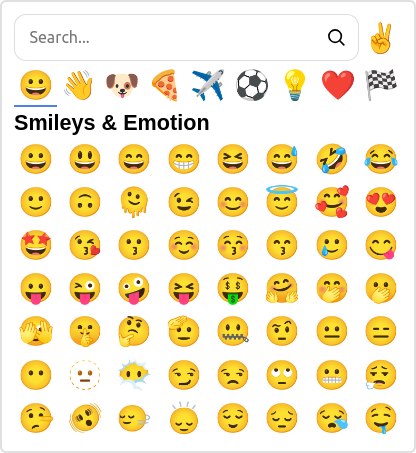

# dioxus-emoji-picker

<div align="center">
  
</div>

# Usage

```rust

use dioxus_emoji_picker::prelude::*;

#[component]
fn example() -> Element

  let content = use_signal(|| String::new());

  rsx! {
    div {
      EmojiPicker { content : content },
    }
  }
}
```

# CSS

Copy assets/emoji_picker.css into your asset/ folder.
Colors and sizes can be styled with CSS variables:

| Variable | Default | Description |
|:-----|:--------:|------:|
| --font-size   | 1.5em | Font-size |
| --emoji-size | 1.5em | Size of emojis |
| --num-columns | 9 | Number of columns in emoji grid |
| --num-rows | 10 | Number of rows in emoji grid |
| --background | white | Background color |
| --border-color | #e0e0e0 | Border color |
| --border-size | 1px | Width of border |
| --border-radius | 0 | Radius of border |
| --box-shadow | none | Box shadow |
