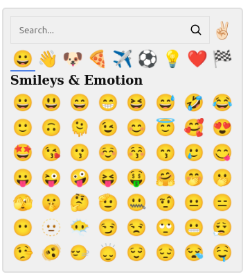

# dioxus-emoji-picker

<div align="center">
  
</div>

# Usage

```rust

use dioxus_emoji_picker::prelude::*;

#[component]
fn example() -> Element

  let content = use_signal(|| String::new());

  rsx! {
    div {
      EmojiPicker { content : content },
    }
  }
}
```

# CSS

Copy contents assets/emoji_picker.css into your css file.

